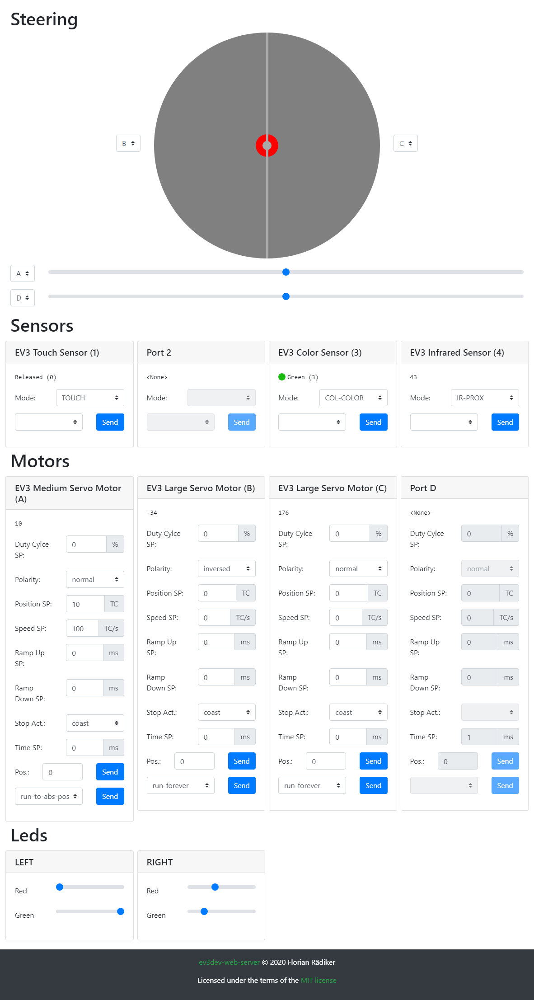

ev3dev-web-server
=================

This simple web server for [ev3dev](https://github.com/ev3dev/ev3dev) enables the user to:

* Monitor sensor values and motor positions
* Control motors by sending commands
* Change sensor modes
* Steer the robot using a joystick-like interface

This project consists of two components:

1. The actual web server, [a Python script](server.py) which sends values to clients and receives commands through *WebSockets*.
2. A [website](website/) which receives values through JavaScript and sends values to the server.

Getting Started
---------------

1. Copy this repository to your ev3dev device, e.g. by cloning.
2. Install `tornado`: 
   `$ sudo apt install python3-tornado`
3. Run `python3 server.py`.
4. In a browser, open `<ev3dev ip>:8000`.

### Password Protection
Access to the website can optionally be protected by a username and password, using [HTTP Basic Authentication](https://developer.mozilla.org/en-US/docs/Web/HTTP/Authentication). 
To enable password protection, follow these steps:

 1. Install `htpasswd`, which is included in `apache2-utils`: 
    `$ sudo apt install apache2-utils`
 2. `cd` into the `ev3dev-web-server` directory, then create a `.htpasswd` file (replace `<username>` by a username of your choice): 
    `$ htpasswd -c .htpasswd <username>`
 3. Users are now asked to authenticate before they can access the website.

*Note that you should change the password of the `robot` user.* Otherwise, anyone can log in via ssh using the default password (`maker`) and delete or change the `.htpasswd` file. 
The password can be changed via `sudo ev3dev-config`.

Screenshot
----------

Licensing
-------

This project is licensed under the terms of the MIT license, see [LICENSE](LICENSE).

This project uses Bootstrap v4.5.2, see [website/bootstrap.min.css](website/bootstrap.min.css).
